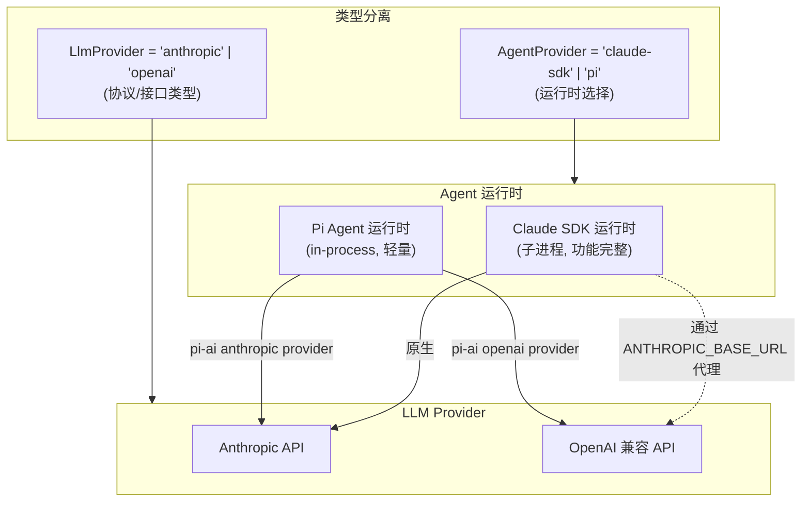

# 技术设计：跨 Provider 模型支持（v2 — 整合 Codex 审查反馈）

## 架构概览



## 核心设计决策

### 1. 类型分离：运行时 vs 协议

引入两个独立类型，解决 Codex 审查中发现的"auto-detect 链路混淆"问题：

- `AgentProvider = 'claude-sdk' | 'pi'` — 用户持久化的运行时选择
- `LlmProvider = 'anthropic' | 'openai'` — 协议级别的接口类型，用于 auto-detect、probe、API 测试

`AutoDetectResult.provider` 保持 `LlmProvider` 类型（协议检测结果）。UI 层负责将 `LlmProvider` 映射为推荐的 `AgentProvider`：
- Anthropic 检测成功 → 推荐 `'claude-sdk'`，允许切换到 `'pi'`
- OpenAI 检测成功 → 推荐 `'pi'`

### 2. Pi Agent 的模型解析策略

pi-ai 的 `getModels()` 返回的 Model 对象包含 `provider` 字段。利用此字段自动判断 API key：

```
模型 ID → pi-ai 查找 → Model.provider → 选择对应 API key
                                          ├─ 'anthropic' → 使用 config.apiKey
                                          └─ 'openai' → 使用 config.openai.apiKey
```

**不引入** `piModelProvider` 或 `DEFAULT_PI_ANTHROPIC_MODEL_IDS`。Pi+Anthropic 时直接复用 `DEFAULT_MODEL_IDS`（与 Claude SDK 相同的 Claude 模型）。

### 3. Pi 会话重建策略

解决 Codex 审查中发现的"配置变更后 Pi 会话不重建"问题：

- 当用户在 Settings 中保存 API key、base URL 或 model ID 时，自动调用 `resetOpenAISession()` + `chat:reset-session`
- Pi 路径每次 `sendOpenAIMessage()` 时检查当前 model preference 是否与活跃会话一致，不一致则重建

### 4. Model-aware API key 校验

解决 Codex 审查中发现的"Pi+Anthropic 下错误拦截"问题：

`chat:send-message` handler 中，当 provider 是 `'pi'` 时：
1. 先解析当前 model preference 对应的模型 ID
2. 通过 `resolveModel()` 判断是 Anthropic 还是 OpenAI 模型
3. 检查对应的 API key 是否存在

### 5. Pi 路径 per-tier 模型支持

Pi Agent 模式下，per-tier 模型选择逻辑：

1. 如果模型是 Anthropic 类型：复用 `customModelIds`（与 Claude SDK 共享），fallback 到 `DEFAULT_MODEL_IDS`
2. 如果模型是 OpenAI 类型：使用 `openai.modelId` 作为所有 tier 的统一 override，fallback 到 `DEFAULT_OPENAI_MODEL_IDS`

### 6. 配置结构（无破坏性变更）

```typescript
interface AppConfig {
  agentProvider?: AgentProvider;        // 'claude-sdk' | 'pi'（兼容旧值 'anthropic'/'openai'）
  apiKey?: string;                      // Anthropic API key（两个运行时共用）
  apiBaseUrl?: string;                  // Anthropic base URL
  openai?: OpenAIConfig;                // OpenAI 配置（Pi Agent 使用）
  customModelIds?: CustomModelIds;      // Per-tier 模型覆盖（两个运行时共用 Anthropic 模型时）
  // ... 其它字段不变
}
```

## 需要修改的文件清单

### 核心逻辑层（main process）

| 文件 | 改动说明 |
|------|----------|
| `src/shared/types/ipc.ts` | 新增 `LlmProvider` 类型；`AgentProvider` 改为 `'claude-sdk' \| 'pi'`；`AutoDetectResult.provider` 改为 `LlmProvider` |
| `src/main/lib/config.ts` | `getAgentProvider()` 添加旧值兼容映射 |
| `src/main/lib/openai-session.ts` | `resolveModel()` 支持 Anthropic + 自定义 base URL；auth key 根据 model.provider 选择；model preference 变更时重建会话 |
| `src/main/handlers/chat-handlers.ts` | API key 校验改为 model-aware：Pi 路径先 resolve model 再检查对应 key |
| `src/main/handlers/config-handlers.ts` | `AutoDetectResult`/`ProbeDetail` 的 `provider` 字段改为 `LlmProvider`；auto-detect 结果不再直接 setAgentProvider |

### IPC 桥接层

| 文件 | 改动说明 |
|------|----------|
| `src/preload/index.ts` | 类型引用自动跟随 shared types |
| `src/renderer/electron.d.ts` | `AgentProvider` 更新；新增 `LlmProvider` 引用 |

### UI 层（renderer）

| 文件 | 改动说明 |
|------|----------|
| `src/renderer/pages/Settings.tsx` | 运行时选择 UI ('Claude SDK' / 'Pi Agent')；Pi Agent 下允许配 Anthropic key + 模型；auto-detect 结果映射为运行时推荐 |

## 详细设计

### openai-session.ts 重构

#### resolveModel() 增强

```typescript
function resolveModel(modelId: string): Model<Api> | undefined {
  // 1. 尝试所有内置 provider（OpenAI、Anthropic 等）
  const allModels = getModels();
  const builtinModel = allModels.find(m => m.id === modelId);
  if (builtinModel) {
    // 如果有自定义 base URL 且 provider 匹配，覆盖 baseUrl
    if (builtinModel.provider === 'openai') {
      const customBase = getOpenAIBaseUrl();
      if (customBase) return { ...builtinModel, baseUrl: customBase };
    } else if (builtinModel.provider === 'anthropic') {
      const customBase = getApiBaseUrl();
      if (customBase) return { ...builtinModel, baseUrl: customBase };
    }
    return builtinModel;
  }

  // 2. 自定义 base URL 兜底（OpenAI 兼容）
  const openaiBase = getOpenAIBaseUrl();
  if (openaiBase) {
    return { id: modelId, provider: 'openai', api: 'openai-completions', baseUrl: openaiBase, ... };
  }

  // 3. Anthropic base URL 兜底
  const anthropicBase = getApiBaseUrl();
  if (anthropicBase) {
    return { id: modelId, provider: 'anthropic', api: 'anthropic-messages', baseUrl: anthropicBase, ... };
  }
}
```

#### Auth Key 选择

```typescript
const authStorage = AuthStorage.inMemory();
const isAnthropic = model.provider === 'anthropic' || model.api === 'anthropic-messages';
if (isAnthropic) {
  const key = getApiKey();
  if (!key) throw new Error('Anthropic API key is not configured');
  authStorage.setRuntimeApiKey('anthropic', key);
} else {
  const key = getOpenAIApiKey();
  if (!key) throw new Error('OpenAI API key is not configured');
  authStorage.setRuntimeApiKey('openai', key);
}
```

#### Model Preference 获取（Pi 路径）

```typescript
export function getPiModelForPreference(preference: ChatModelPreference): string {
  // 先检查 OpenAI 自定义模型
  const openaiModelId = getOpenAIModelId();
  if (openaiModelId) return openaiModelId;

  // 检查 per-tier 自定义模型（共享，可能是 Anthropic 模型）
  const customIds = getCustomModelIds();
  const perTierCustom = customIds[preference]?.trim();
  if (perTierCustom) return perTierCustom;

  // 默认：使用 OpenAI 默认模型
  return DEFAULT_OPENAI_MODEL_IDS[preference] ?? DEFAULT_OPENAI_MODEL_IDS.fast;
}
```

### chat-handlers.ts — Model-aware 校验

```typescript
if (provider === 'pi') {
  // 先 resolve model 判断需要哪个 key
  const modelId = getPiModelForPreference(getCurrentModelPreference());
  const model = resolveModel(modelId);
  const isAnthropic = model?.provider === 'anthropic' || model?.api === 'anthropic-messages';
  const key = isAnthropic ? getApiKey() : getOpenAIApiKey();
  if (!key) {
    return { success: false, error: isAnthropic ?
      'Anthropic API key is not configured...' :
      'OpenAI API key is not configured...' };
  }
} else {
  // Claude SDK 路径：检查 Anthropic key
  if (!getApiKey()) { ... }
}
```

### config.ts — 兼容映射

```typescript
export function getAgentProvider(): AgentProvider {
  const config = loadConfig();
  const stored = config.agentProvider;
  if (stored === 'anthropic') return 'claude-sdk';
  if (stored === 'openai') return 'pi';
  return stored === 'pi' ? 'pi' : 'claude-sdk';
}
```

### auto-detect — 类型分离

`AutoDetectResult.provider` 和 `ProbeDetail.provider` 改为 `LlmProvider`。UI 层在 `handleConfirmAutoConfig()` 中：

```typescript
// 协议检测结果 → 推荐运行时
const recommendedRuntime: AgentProvider =
  detectedProvider === 'anthropic' ? 'claude-sdk' : 'pi';
await window.electron.config.setAgentProvider(recommendedRuntime);
```

## 测试策略

1. **单元测试**：`resolveModel()` 覆盖 OpenAI、Anthropic、自定义 base URL、未知模型
2. **回归测试**：确保 Claude SDK + Anthropic、Pi + OpenAI 原路径正常
3. **配置迁移**：旧值 `'anthropic'`/`'openai'` 正确映射
4. **会话重建**：配置变更后 Pi 会话重建验证

## 安全考虑

- API key 处理逻辑不变：本地提取、不上传、不暴露完整值到 renderer
- Pi + Anthropic 路径使用 `AuthStorage.inMemory()`，key 不持久化到 pi 文件系统
- 自定义 base URL 继承确保代理/网关兼容性
