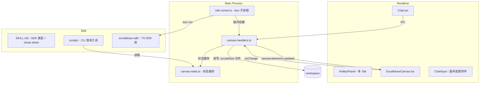

# 技术设计文档

## 架构概览

本功能在现有 Electron 三进程架构（main / preload / renderer）上扩展，新增以下模块：



## 技术栈与选型

| 选型 | 方案 | 原因 |
|------|------|------|
| 画布引擎 | `@excalidraw/excalidraw@0.18.x` | 轻量开源、React 组件、标准 JSON 格式 |
| SDK 执行 | `bun run` 子进程 | 与 main process 隔离、天然支持 TS |
| 类型校验 | `tsc --noEmit` (bun 内置) | 执行前捕获错误 |
| 格式转换 | `convertToExcalidrawElements` | excalidraw 官方 API，处理 label binding 等 |
| 文件格式 | 标准 `.excalidraw` JSON | 兼容 excalidraw.com |

## 模块设计

### 1. 简化元素格式（Simplified Element Format）

Agent 和 SDK 使用的简化格式，与 excalidraw 原生格式通过转换层双向映射。

```typescript
// src/shared/types/canvas.ts

interface SimpleRect {
  id: string
  type: 'rectangle'
  x: number; y: number; w: number; h: number
  label?: string
  color?: ElementColor        // 'blue' | 'red' | 'green' | ...
  fill?: 'solid' | 'hachure' | 'cross-hatch' | 'none'
}

interface SimpleEllipse {
  id: string
  type: 'ellipse'
  x: number; y: number; w: number; h: number
  label?: string
  color?: ElementColor
  fill?: 'solid' | 'hachure' | 'cross-hatch' | 'none'
}

interface SimpleDiamond {
  id: string
  type: 'diamond'
  x: number; y: number; w: number; h: number
  label?: string
  color?: ElementColor
  fill?: 'solid' | 'hachure' | 'cross-hatch' | 'none'
}

interface SimpleArrow {
  id: string
  type: 'arrow'
  from: string              // 源元素 ID
  to: string                // 目标元素 ID
  label?: string
  color?: ElementColor
}

interface SimpleText {
  id: string
  type: 'text'
  x: number; y: number
  text: string
  fontSize?: number         // 默认 20
  color?: ElementColor
}

interface SimpleLine {
  id: string
  type: 'line'
  points: [number, number][]  // [[x1,y1], [x2,y2], ...]
  color?: ElementColor
}

type SimpleElement = SimpleRect | SimpleEllipse | SimpleDiamond | SimpleArrow | SimpleText | SimpleLine

type ElementColor = 'black' | 'blue' | 'red' | 'green' | 'orange' | 'purple' | 'pink' | 'yellow' | 'gray'
```

### 2. 格式转换层

**关键约束：** `@excalidraw/excalidraw` 依赖浏览器 API（Canvas、DOM），只能在 renderer process 中使用。因此转换层需要拆分为两部分：

**Part A — Main Process（纯数据操作，无 DOM 依赖）：**

```typescript
// src/main/lib/canvas-converter.ts

// 简化格式 → 中间格式（不依赖 excalidraw 库）
// 处理：颜色映射、默认值填充、ID 生成
function toIntermediateElements(simplified: SimpleElement[]): IntermediateElement[]

// 中间格式 → 简化格式（从 .excalidraw 文件读取后）
function toSimplifiedElements(intermediate: IntermediateElement[]): SimpleElement[]

// 颜色映射
const COLOR_MAP: Record<ElementColor, string> = {
  black: '#1e1e1e',
  blue: '#1971c2',
  red: '#e03131',
  green: '#2f9e44',
  // ...
}
```

**Part B — Renderer Process（依赖 excalidraw API）：**

```typescript
// src/renderer/lib/canvas-excalidraw-converter.ts

// 中间格式 → Excalidraw 原生格式
// 使用 convertToExcalidrawElements() 处理 label binding、arrow binding 等
function toExcalidrawElements(intermediate: IntermediateElement[]): ExcalidrawElement[]

// Excalidraw 原生格式 → 中间格式
function fromExcalidrawElements(elements: ExcalidrawElement[]): IntermediateElement[]
```

转换层的核心职责：
- `createArrow({ from, to })` → 计算 `startBinding`、`endBinding`、`points`
- `label: "文本"` → 创建独立 text 元素 + `boundElements` 引用
- 省略的字段填充默认值（seed、roughness、opacity 等）
- 反向转换时忽略 bound text 元素，将其合并回 `label` 字段

### 3. TS SDK 设计

SDK 是一个独立的 npm 包（本地路径引用），agent 写的 TS 代码 `import` 它。

```typescript
// .claude/skills/excalidraw/sdk/index.ts

class ExcalidrawSDK {
  private elements: SimpleElement[] = []
  private existingElements: SimpleElement[] = []

  /** 加载已有画布状态 */
  static async load(filePath: string): Promise<ExcalidrawSDK>

  /** 创建矩形 */
  createRectangle(opts: Omit<SimpleRect, 'id' | 'type'>): ElementRef

  /** 创建椭圆 */
  createEllipse(opts: Omit<SimpleEllipse, 'id' | 'type'>): ElementRef

  /** 创建菱形 */
  createDiamond(opts: Omit<SimpleDiamond, 'id' | 'type'>): ElementRef

  /** 创建箭头，from/to 可以是 ElementRef 或字符串 ID */
  createArrow(opts: { from: ElementRef | string; to: ElementRef | string; label?: string; color?: ElementColor }): ElementRef

  /** 创建文本 */
  createText(opts: Omit<SimpleText, 'id' | 'type'>): ElementRef

  /** 创建线条 */
  createLine(opts: Omit<SimpleLine, 'id' | 'type'>): ElementRef

  /** 输出操作结果为 JSON（供 main process 消费） */
  async commit(): Promise<void>
}

class ElementRef {
  readonly id: string

  /** 补丁更新 */
  update(patch: Partial<SimpleElement>): void

  /** 删除 */
  delete(): void
}
```

**执行流程：**

1. Agent 生成 TS 文件写入 workspace 临时目录
2. Main process 调用 `bun run --bun <file.ts>` 执行
3. SDK 的 `commit()` 将操作结果序列化为 JSON 输出到 stdout
4. Main process 解析 stdout，通过转换层转为 excalidraw 格式
5. 写入 `.excalidraw` 文件 + 通过 IPC 通知 renderer 更新画布

### 4. CLI 工具设计

```bash
# 查询画布状态（简化 JSON）
excalidraw-cli read <file.excalidraw>

# 获取画布截图
excalidraw-cli screenshot <file.excalidraw> --output <path.png>
```

CLI 工具编译为独立二进制（`bun --compile`），与现有 skill scripts 模式一致。

**`read` 命令：** 读取 `.excalidraw` 文件 → 转换为简化格式 → 输出 JSON

**`screenshot` 命令：** CLI 环境无法渲染 Excalidraw（需要 DOM），因此截图不通过 CLI 实现。改为 skill 工具层面提供：agent 通过 IPC 请求 renderer 截图（`canvas:screenshot` channel），renderer 调用 `exportToBlob()` 保存到指定路径后返回。这比"写请求文件→轮询等待"的方案更可靠。

### 5. IPC 协议扩展

新增 `canvas:*` 命名空间：

| Channel | 方向 | 用途 |
|---------|------|------|
| `canvas:open-file` | renderer→main | 打开/创建 .excalidraw 文件 |
| `canvas:save-file` | renderer→main | 保存画布内容到文件 |
| `canvas:load-file` | renderer→main | 加载 .excalidraw 文件内容 |
| `canvas:elements-updated` | main→renderer | SDK 执行后通知画布更新 |
| `canvas:run-sdk` | main 内部 | 执行 agent 生成的 TS 代码 |
| `canvas:screenshot` | main→renderer | 请求 renderer 截图 |
| `canvas:screenshot-result` | renderer→main | 返回截图结果 |
| `canvas:get-state` | main 内部 | CLI 查询当前画布状态 |

### 6. 右侧工作区改造

**当前状态：** `ArtifactPanel` 仅支持单个 artifact，无 tab。

**改造方案：**

```typescript
// src/renderer/pages/Chat.tsx 状态变更

// Before:
const [selectedArtifact, setSelectedArtifact] = useState<Artifact | null>(null)

// After:
const [openTabs, setOpenTabs] = useState<WorkspaceTab[]>([])
const [activeTabId, setActiveTabId] = useState<string | null>(null)

interface WorkspaceTab {
  id: string
  type: 'artifact' | 'excalidraw'
  title: string              // 文件名
  filePath: string
  artifact?: Artifact        // type=artifact 时
  isDirty?: boolean          // 未保存标记
}
```

**组件结构：**

```
WorkspacePanel (新)
├── TabBar
│   ├── Tab (artifact) × N
│   └── Tab (excalidraw) × N
├── ArtifactPanel (type=artifact 时)
└── ExcalidrawCanvas (type=excalidraw 时)
```

`ExcalidrawCanvas` 组件封装 `@excalidraw/excalidraw` 的 `Excalidraw` React 组件，处理：
- 加载/保存 `.excalidraw` 文件
- onChange 事件 → debounced 自动保存 + 变更检测
- 接收 IPC 事件更新画布（SDK 执行结果）
- 暴露截图能力

### 7. 双向同步 - 画布变更附件

**变更检测：**

```typescript
// src/renderer/hooks/useCanvasChanges.ts

interface CanvasChange {
  type: 'added' | 'modified' | 'deleted'
  elementId: string
  elementType: string
  summary: string           // "添加了矩形 '服务A'"
}

// Excalidraw onChange 触发时
// 对比上次 agent 操作后的快照，生成变更列表
// 写入 pendingCanvasChanges 状态
```

**附件展示：**

在 `ChatInput` 中，当 `pendingCanvasChanges` 非空时，显示一个特殊附件卡片：

```
┌──────────────────────┐
│ 📋 画布修改 (3项)      │
│ + 矩形 "服务C"        │
│ ~ 箭头 "调用" 颜色改为红 │
│ - 文本 "旧标题"        │
└──────────────────────┘
```

用户发送消息时，变更摘要作为消息附件一同发送给 agent。

### 8. Built-in Skill 结构

```
.claude/skills/excalidraw/
├── manifest.json
├── .builtin
├── SKILL.md                    # Agent 的 cheat sheet
├── sdk/
│   ├── index.ts                # SDK 入口
│   ├── types.ts                # SimpleElement 类型定义
│   └── package.json            # 本地包
└── scripts/
    ├── excalidraw-cli.ts       # CLI 工具源码
    └── (compiled binary)       # bun --compile 产物
```

**SKILL.md 内容要点：**
- SDK 完整类型定义（嵌入）
- 使用示例（流程图、架构图等）
- CLI 命令参考
- 颜色表 / 布局建议
- Agent 写代码的模板

### 9. 文件类型注册

在 `src/shared/file-extensions.ts` 中新增：

```typescript
EXCALIDRAW_EXTENSIONS = ['excalidraw']
```

在 artifact 提取逻辑中，`.excalidraw` 文件不走 ArtifactPanel 的只读预览，而是自动打开为 ExcalidrawCanvas tab。

## 需要修改的文件清单

### 新增文件

| 文件 | 用途 |
|------|------|
| `src/shared/types/canvas.ts` | SimpleElement 类型定义 |
| `src/main/lib/canvas-converter.ts` | 简化格式 ↔ 中间格式转换（纯数据，无 DOM） |
| `src/renderer/lib/canvas-excalidraw-converter.ts` | 中间格式 ↔ excalidraw 原生格式转换（依赖 excalidraw API） |
| `src/main/lib/canvas-state.ts` | 画布状态缓存管理 |
| `src/main/lib/sdk-runner.ts` | bun 子进程执行 agent 代码 |
| `src/main/handlers/canvas-handlers.ts` | canvas:* IPC 处理器 |
| `src/renderer/components/WorkspacePanel.tsx` | 多 tab 工作区面板 |
| `src/renderer/components/ExcalidrawCanvas.tsx` | Excalidraw 画布组件 |
| `src/renderer/components/TabBar.tsx` | Tab 栏组件 |
| `src/renderer/components/CanvasChangeAttachment.tsx` | 画布变更附件卡片 |
| `src/renderer/hooks/useCanvasChanges.ts` | 画布变更检测 hook |
| `.claude/skills/excalidraw/` | 整个 skill 目录 |

### 修改文件

| 文件 | 修改内容 |
|------|----------|
| `src/renderer/pages/Chat.tsx` | 工作区状态从单 artifact 改为多 tab |
| `src/renderer/components/ChatInput.tsx` | 支持画布变更附件展示 |
| `src/renderer/components/Message.tsx` | 折叠展示 agent 画图代码 |
| `src/preload/index.ts` | 添加 canvas:* IPC bridge |
| `src/renderer/electron.d.ts` | 添加 canvas:* 类型声明 |
| `src/main/index.ts` | 注册 canvas handlers |
| `src/shared/file-extensions.ts` | 添加 .excalidraw 扩展名 |
| `package.json` | 添加 @excalidraw/excalidraw 依赖 |
| `electron.vite.config.ts` | excalidraw 相关构建配置 |

## 测试策略

| 层级 | 测试内容 | 方式 |
|------|----------|------|
| 单元测试 | canvas-converter 双向转换 | bun test |
| 单元测试 | SDK commit() 输出格式 | bun test |
| 单元测试 | CLI read 命令解析 | bun test |
| 集成测试 | SDK 执行 → 文件写入 → IPC 通知 | bun test + mock IPC |
| 手动测试 | Excalidraw 画布交互 | dev 模式 |
| 手动测试 | 双向同步流程 | dev 模式 |

## 安全考虑

1. **SDK 代码执行隔离**：通过 `bun run` 子进程执行，不在 main process eval，防止恶意代码影响应用
2. **文件路径校验**：SDK 只能操作 workspace 目录下的 `.excalidraw` 文件，防止路径穿越
3. **执行超时**：SDK 子进程设置 30s 超时，防止无限循环
4. **输出大小限制**：SDK stdout 输出限制 5MB，防止内存溢出
