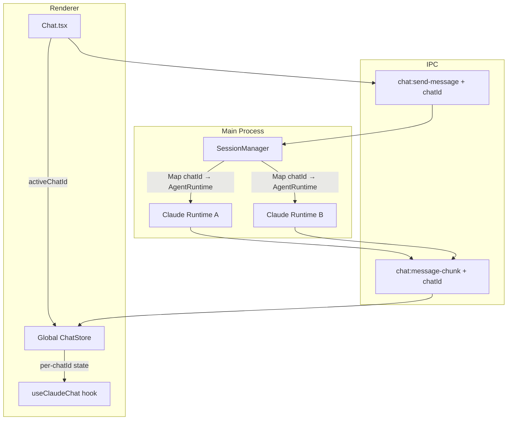
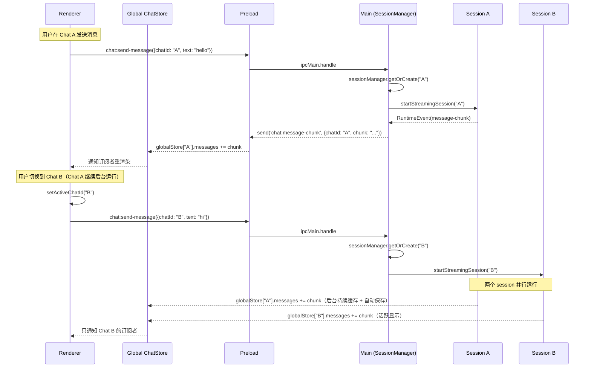

# 技术设计：多会话并行

## 架构概览

### 核心概念：`chatId` 作为全栈路由键

引入 `chatId`（renderer 生成的 UUID）作为多会话路由的核心标识符。每个聊天（无论是否已持久化为 conversation）都有一个唯一的 `chatId`，贯穿 renderer → IPC → main process 全链路。

> **为什么不用 `conversationId`？** 新建聊天在首次自动保存之前没有 conversationId（值为 null），但 IPC 事件从第一条消息开始就需要路由。`chatId` 是 renderer 端生成的 UUID，生命周期覆盖整个聊天过程。



## 需要修改的文件

### Main Process（核心变更）

| 文件 | 变更 | 说明 |
|------|------|------|
| `src/main/lib/session-manager.ts` | **新建** | 多 session 状态管理器，基于已有 `AgentRuntime` 接口 |
| `src/main/lib/claude-session.ts` | 重构 | 所有函数接受 `chatId`；所有 IPC emit 携带 `chatId`；内部状态移至 per-chat |
| `src/main/lib/message-queue.ts` | 删除 | 功能合并到 session-manager.ts 的 per-chat 状态中 |
| `src/main/handlers/chat-handlers.ts` | 修改 | 从 payload 提取 `chatId`，通过 SessionManager 路由 |
| `src/main/lib/openai-session.ts` | 修改 | 仅 IPC emit 增加 `chatId`，暂不支持多实例（v1 scope 外） |

### IPC 层

| 文件 | 变更 | 说明 |
|------|------|------|
| `src/shared/types/ipc.ts` | 修改 | `SendMessagePayload` 增加 `chatId` 字段 |
| `src/preload/index.ts` | 修改 | 所有 `on*` 回调增加 `chatId`；`stopMessage`/`resetSession` 增加 `chatId` 参数 |
| `src/renderer/electron.d.ts` | 修改 | 同步类型更新 |

### Renderer（状态管理变更）

| 文件 | 变更 | 说明 |
|------|------|------|
| `src/renderer/hooks/useClaudeChat.ts` | 重构 | 改为全局 ChatStore + per-chatId 订阅 |
| `src/renderer/pages/Chat.tsx` | 修改 | 管理 `activeChatId`；移除 `isLoading` 阻塞切换的逻辑 |

## 详细设计

### 1. Session Manager（`src/main/lib/session-manager.ts`）

基于已有 `AgentRuntime` 接口（`src/main/lib/agent-runtime.ts`）构建。每个 `chatId` 对应一个独立的 runtime 实例和 session 状态。

```typescript
interface ManagedSession {
  chatId: string;
  provider: AgentProvider;  // 创建时锁定 provider，不随全局切换变化
  // Claude session 状态（per-chat）
  querySession: Query | null;
  isProcessing: boolean;
  shouldAbortSession: boolean;
  sessionTerminationPromise: Promise<void> | null;
  isInterruptingResponse: boolean;
  sessionGeneration: number;
  pendingResumeSessionId: string | null;
  // Message queue（原 message-queue.ts 功能，per-chat）
  messageQueue: MessageQueueItem[];
  sessionId: string;
  shouldAbortGenerator: boolean;
  // Stream state
  streamIndexToToolId: Map<number, string>;
  // Rate limit（per-chat 独立追踪）
  lastRateLimitNoticeAt: number;
  rateLimitAttempt: number;
}

class SessionManager {
  private sessions = new Map<string, ManagedSession>();

  /** 获取或创建 session，锁定当前 provider */
  getOrCreate(chatId: string): ManagedSession;

  /** 销毁 session 并清理资源 */
  destroy(chatId: string): Promise<void>;

  get(chatId: string): ManagedSession | undefined;
  has(chatId: string): boolean;

  /** scheduled task 检查用 */
  isAnyChatActive(): boolean;

  /** 返回所有运行中的 chatId（用于 model preference 广播） */
  listActive(): string[];
}
```

**provider 锁定**：每个 chat 创建时记录当时的 `AgentProvider`（`'anthropic' | 'openai'`）。后续该 chat 的 stop/reset/send 始终路由到创建时的 provider，不受全局 provider 切换影响。

### 2. IPC 协议变更

#### 2.1 Renderer → Main（invoke）

```typescript
// SendMessagePayload 增加 chatId
interface SendMessagePayload {
  text: string;
  chatId: string;                              // 新增
  attachments?: SerializedAttachmentPayload[];
}

// stopMessage 和 resetSession 增加 chatId
chat.stopMessage(chatId: string)
chat.resetSession(chatId: string, resumeSessionId?: string | null)
```

#### 2.2 Main → Renderer（event）— 增量式变更

**不做一次性破坏性变更**。在已有的 `runtimeEventToIpc()` 中扩展，为每个 IPC channel 的 args 注入 `chatId`：

```typescript
// agent-runtime.ts 中修改 runtimeEventToIpc，增加 chatId 参数
export function runtimeEventToIpc(
  event: RuntimeEvent,
  chatId: string            // 新增参数
): { channel: string; args: unknown[] } {
  switch (event.type) {
    case 'message-chunk':
      // 原来：args: [event.text]
      // 现在：args: [{ chatId, chunk: event.text }]
      return { channel: 'chat:message-chunk', args: [{ chatId, chunk: event.text }] };
    case 'message-complete':
      return { channel: 'chat:message-complete', args: [{ chatId }] };
    // ... 所有其他事件同理
  }
}
```

对于 `task-progress` / `task-notification` 等使用共享类型的事件，在 payload 中增加 `chatId` 字段：

```typescript
// TaskProgressEvent / TaskNotificationEvent 类型扩展
interface TaskProgressEvent {
  chatId?: string;  // 可选，向后兼容
  taskId: string;
  // ...existing fields
}
```

#### 2.3 Preload Bridge 变更

所有 `on*` 方法的回调签名变更为包含 `chatId` 的新类型：

```typescript
// 原来
onMessageChunk: (callback: (chunk: string) => void) => () => void;
// 现在
onMessageChunk: (callback: (data: { chatId: string; chunk: string }) => void) => () => void;

// 原来
onMessageComplete: (callback: () => void) => () => void;
// 现在
onMessageComplete: (callback: (data: { chatId: string }) => void) => () => void;

// 原来
onSessionUpdated: (callback: (data: { sessionId: string; resumed: boolean }) => void) => () => void;
// 现在
onSessionUpdated: (callback: (data: { chatId: string; sessionId: string; resumed: boolean }) => void) => () => void;
```

### 3. Renderer 状态管理

#### 3.1 全局 ChatStore（解决后台消息丢失问题）

**问题**：当用户切换到对话 B 时，对话 A 的 IPC 事件仍会到达 renderer。如果只靠 hook 过滤，A 的后台消息会丢失。

**方案**：在 hook 外部维护一个全局 store，按 chatId 缓存所有消息和状态。全局 IPC 监听器只注册一次，持续接收所有 chatId 的事件。

```typescript
// src/renderer/stores/chatStore.ts

interface ChatState {
  messages: Message[];
  isLoading: boolean;
  isStreaming: boolean;
  sessionId: string | null;        // per-chat sessionId，解决串写问题
  backgroundTasks: Map<string, BackgroundTask>;
  retryStatus: ActiveRetryStatus | null;
  debugMessages: string[];
  subscribers: Set<() => void>;    // 通知订阅组件重渲染
}

// 全局 store
const chatStates = new Map<string, ChatState>();

// conversationId → chatId 双向映射
const conversationToChatId = new Map<string, string>();
const chatIdToConversation = new Map<string, string>();

/** 全局 IPC 监听器，只初始化一次 */
function initGlobalListeners(): void {
  window.electron.chat.onMessageChunk((data) => {
    const state = getOrCreateState(data.chatId);
    // 原 useClaudeChat 的 onMessageChunk 逻辑...
    notifySubscribers(state);
  });

  window.electron.chat.onSessionUpdated((data) => {
    const state = getOrCreateState(data.chatId);
    state.sessionId = data.sessionId;  // 不再串写到全局变量
    notifySubscribers(state);
  });

  // ... 其他 16+ 事件同理
}

/** 注册 conversationId → chatId 映射（自动保存回填用） */
function registerConversationMapping(conversationId: string, chatId: string): void {
  conversationToChatId.set(conversationId, chatId);
  chatIdToConversation.set(chatId, conversationId);
}

/** 查询对话运行状态（侧边栏用） */
function getConversationStatus(conversationId: string): 'idle' | 'running' | 'error' {
  const chatId = conversationToChatId.get(conversationId);
  if (!chatId) return 'idle';
  const state = chatStates.get(chatId);
  if (!state) return 'idle';
  if (state.retryStatus) return 'error';
  return state.isLoading ? 'running' : 'idle';
}

/** 清理 session（对话删除时调用） */
function destroyChatState(chatId: string): void {
  const state = chatStates.get(chatId);
  if (state?.isLoading) {
    window.electron.chat.stopMessage(chatId);
  }
  chatStates.delete(chatId);
  const convId = chatIdToConversation.get(chatId);
  if (convId) conversationToChatId.delete(convId);
  chatIdToConversation.delete(chatId);
}
```

#### 3.2 `useClaudeChat(chatId)` 重构

hook 变为全局 store 的薄包装：

```typescript
export function useClaudeChat(chatId: string | null) {
  const [, forceUpdate] = useReducer(x => x + 1, 0);

  useEffect(() => {
    if (!chatId) return;
    const state = getOrCreateState(chatId);
    state.subscribers.add(forceUpdate);
    return () => { state.subscribers.delete(forceUpdate); };
  }, [chatId]);

  const state = chatId ? chatStates.get(chatId) : null;
  return {
    messages: state?.messages ?? [],
    setMessages: (fn) => { /* 更新 store 中对应 chatId 的 messages */ },
    isLoading: state?.isLoading ?? false,
    setIsLoading: (v) => { /* 更新 store */ },
    backgroundTasks: state?.backgroundTasks ?? new Map(),
    retryStatus: state?.retryStatus ?? null,
    sessionId: state?.sessionId ?? null,  // 每个 chat 独立的 sessionId
  };
}
```

#### 3.3 `Chat.tsx` 变更

**移除 `isLoading` 阻塞切换**：当前 `handleNewChat` 和 `handleLoadConversation` 都有 `if (isLoading) return;` 保护。多会话模式下必须移除，允许随时切换。

```typescript
// 新增状态
const [activeChatId, setActiveChatId] = useState<string>(() => crypto.randomUUID());

// useClaudeChat 接受 activeChatId
const { messages, setMessages, isLoading, setIsLoading, sessionId, ... } =
  useClaudeChat(activeChatId);

// handleNewChat：不 reset session，只切换 chatId
const handleNewChat = async () => {
  // 保存当前对话（fire-and-forget，不阻塞）
  if (currentConversationId && messages.length > 0) { /* 保存逻辑不变 */ }

  const newChatId = crypto.randomUUID();
  setActiveChatId(newChatId);
  setCurrentConversationId(null);
  // 不调用 resetSession！
  // 清理 workspace tab 等 UI 状态
  setOpenTabs([]);
  setActiveTabId(null);
  artifactMap.clear();
  canvasChanges.clearChanges();
  prevArtifactCountRef.current = 0;
  isInitialLoadRef.current = true;
};

// handleLoadConversation：复用已打开的 chatId
const handleLoadConversation = async (conversationId: string) => {
  // 保存当前对话（fire-and-forget）
  if (currentConversationId && messages.length > 0) { /* 保存逻辑不变 */ }

  // 检查是否已有对应的 chatId
  const existingChatId = conversationToChatId.get(conversationId);
  if (existingChatId) {
    setActiveChatId(existingChatId);
    setCurrentConversationId(conversationId);
    return;  // 直接切换，不 reset
  }

  // 新 chatId
  const chatId = crypto.randomUUID();
  registerConversationMapping(conversationId, chatId);
  setActiveChatId(chatId);

  // 加载消息到全局 store
  const response = await window.electron.conversation.get(conversationId);
  if (response.success && response.conversation) {
    const parsedMessages = JSON.parse(response.conversation.messages)...;
    const chatState = getOrCreateState(chatId);
    chatState.messages = parsedMessages;
    chatState.sessionId = response.conversation.sessionId ?? null;

    // 通知 main process 准备恢复（但不 kill 其他 session）
    await window.electron.chat.resetSession(chatId, response.conversation.sessionId ?? null);
    setCurrentConversationId(conversationId);
  }
};

// 自动保存回填：首次创建 conversation 时注册映射
useEffect(() => {
  // ... 在 conversation:create 成功后：
  registerConversationMapping(newConversationId, activeChatId);
}, [/* messages changed */]);

// sendMessage 携带 chatId
const submitMessagePayload = async (payload) => {
  await window.electron.chat.sendMessage({
    text: payload.text,
    chatId: activeChatId,              // 新增
    attachments: payload.attachments,
  });
};

// stopMessage 携带 chatId
const handleStopStreaming = async () => {
  await window.electron.chat.stopMessage(activeChatId);
};
```

#### 3.4 后台对话自动保存（解决消息丢失问题）

当前自动保存只保存活跃对话。多会话模式下，后台对话也需要持久化。

方案：全局 store 中对**所有有变更的 chatId** 都触发 debounce 保存，而不仅仅是 activeChatId。

```typescript
// 在全局 store 的事件处理中，每次消息变更后标记 dirty
function markDirty(chatId: string): void {
  const convId = chatIdToConversation.get(chatId);
  if (!convId) return;  // 新对话未保存过，靠 Chat.tsx 首次保存
  debounceSave(convId, chatId);
}

function debounceSave(conversationId: string, chatId: string): void {
  // 防抖 2s 后保存
  const state = chatStates.get(chatId);
  if (!state) return;
  window.electron.conversation.update(
    conversationId, undefined,
    serializeMessagesForStorage(state.messages),
    state.sessionId ?? undefined
  );
}
```

### 4. 左侧对话列表运行状态

使用全局 store 的 `getConversationStatus()` 方法：

```typescript
// 侧边栏组件
function ConversationItem({ conversationId }) {
  // 订阅运行状态变化
  const status = useConversationStatus(conversationId);
  return (
    <div>
      {status === 'running' && <RunningIndicator />}
      {status === 'error' && <ErrorIndicator />}
      {/* ... */}
    </div>
  );
}
```

### 5. OpenAI Provider 处理

**v1 scope**：OpenAI provider 暂不支持多实例并行。原因：
- `pi-coding-agent` 的 `AgentSession` 没有 `session-updated` 事件
- 没有 `resumeSessionId` 入口
- 没有 `setModel()` 路径

处理方式：
- OpenAI session 的 IPC emit 增加 `chatId` 字段（保持路由正确）
- 但只允许一个 OpenAI chat 活跃。如果用户在 OpenAI provider 下新建 chat，先 reset 旧的 OpenAI session
- Claude provider 的 chat 不受影响，可完全并行

### 6. Session 销毁触发时机

| 触发条件 | 动作 |
|---------|------|
| 用户删除对话（`conversation:delete`） | `sessionManager.destroy(chatId)` + `destroyChatState(chatId)` |
| 用户关闭应用 | 所有 session 自动终止（Electron 进程退出） |
| 用户手动停止对话 | 只 interrupt，不 destroy（session 保留供后续消息） |
| OpenAI provider 新建 chat | destroy 旧的 OpenAI chat session |

在 `conversation-handlers.ts` 的 `conversation:delete` handler 中增加 session 清理：

```typescript
ipcMain.handle('conversation:delete', async (_event, id: string) => {
  // 通知 renderer 清理（通过 IPC 事件）
  mainWindow.webContents.send('chat:session-destroyed', { conversationId: id });
  // 或者 renderer 自行在删除成功后清理
  await deleteConversation(id);
});
```

### 7. Model Preference

保持全局设置不变。切换模型时，遍历 `sessionManager.listActive()` 调用每个活跃 session 的 `setModel()`。

### 8. Scheduled Tasks

`isScheduledTaskExecuting()` 保持全局检查。定时任务执行时，所有 chatId 的消息发送都被拒绝（现有行为不变）。`isAnyChatActive()` 替代原 `isSessionActive()` 用于判断是否有交互式 session 在运行。

## 序列图：多会话消息流



## 测试策略

1. **单元测试**：SessionManager 的 create/destroy/get/listActive 方法
2. **集成测试**：两个 chatId 并发发送消息，验证 IPC 路由和 store 更新正确
3. **手动测试清单**：
   - 创建 3 个对话，在每个中发送消息，验证回复路由到正确对话
   - 流式输出期间切换对话，验证后台流继续，切回后消息完整
   - 删除一个正在运行的对话，验证 session 正确终止
   - 加载已保存的对话，验证在正确的 chatId 中打开
   - 同一对话从侧边栏多次点击，验证不创建重复 chatId
   - 在一个对话中停止回复，验证不影响其他对话
   - API 速率限制在不同对话中独立处理
   - 后台对话完成后切回，验证消息完整且已持久化
   - 新对话首次自动保存后，从侧边栏点击能复用原 chatId

## 安全考虑

- 每个 session 使用相同的 API key（全局配置），无额外安全风险
- session 销毁时确保清理所有资源（generator abort、queue clear、process kill）
- 内存管理：闲置时间过长的 session 可考虑自动释放（v1 不实现）
