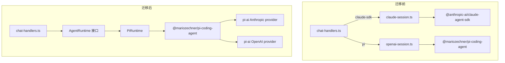

# 技术设计：移除 Claude Agent SDK，统一使用 Pi-Agent

## 架构概览

当前架构是双 runtime（claude-session.ts + openai-session.ts），迁移后统一为单一 pi-coding-agent runtime。核心思路：**实现现有 `AgentRuntime` 接口**（`agent-runtime.ts`），将 pi-coding-agent 事件映射为 `RuntimeEvent`，chat-handlers 通过统一接口调用。



## 需要修改的文件清单

### 删除的文件
| 文件 | 原因 |
|------|------|
| `src/main/lib/claude-session.ts` | Claude SDK 主集成，被 PiRuntime 替代 |
| `src/main/lib/openai-session.ts` | 被 PiRuntime 替代（逻辑合并进新实现） |
| `src/main/lib/claude-session.test.ts` | 对应的测试文件 |

### 新增的文件
| 文件 | 用途 |
|------|------|
| `src/main/lib/pi-runtime.ts` | 实现 `AgentRuntime` 接口，封装 pi-coding-agent 集成 |

### 修改的文件

| 文件 | 变更内容 |
|------|----------|
| `src/main/lib/session-manager.ts` | 移除 `Query`/`SDKUserMessage`/`AgentProvider` 依赖，`ManagedSession` 改为持有 `AgentRuntime` 实例 |
| `src/main/lib/schedule-executor.ts` | 用 pi-coding-agent 的 `createAgentSession()` 替换 Claude SDK 的 `query()` |
| `src/main/handlers/chat-handlers.ts` | 移除双路径分支，统一通过 `AgentRuntime` 接口调用 |
| `src/main/handlers/chat-helpers.ts` | 移除 `SDKUserMessage` 类型，保留 `buildPlainTextWithAttachments`（pi-agent 接收纯文本） |
| `src/main/handlers/config-handlers.ts` | 移除 `config:get-agent-provider`/`config:set-agent-provider` IPC handlers |
| `src/main/handlers/schedule-handlers.ts` | 更新 import 路径（原引用 claude-session.ts） |
| `src/main/lib/scheduler.ts` | 更新 import 路径（原引用 claude-session.ts） |
| `src/main/lib/config.ts` | 移除 `agentProvider` 相关函数，简化 `buildClaudeSessionEnv`（移除 Claude Code 特有变量） |
| `src/shared/types/ipc.ts` | 移除 `AgentProvider` 类型 |
| `src/renderer/types/chat.ts` | 移除 SDK 导入，改为本地类型定义 |
| `src/renderer/pages/Settings.tsx` | 移除 Agent Provider 选择器 UI，简化 API 配置区域 |
| `src/renderer/electron.d.ts` | 移除 `getAgentProvider`/`setAgentProvider` |
| `src/preload/index.ts` | 移除 `getAgentProvider`/`setAgentProvider` bridge |
| `src/main/lib/session-manager.test.ts` | 更新测试，移除 Claude SDK 依赖 |
| `package.json` | 移除 `@anthropic-ai/claude-agent-sdk`，升级 pi-coding-agent |
| `electron.vite.config.ts` | 移除 `asarUnpack` 中的 Claude SDK 条目 |

## 关键设计决策

### 1. 实现 AgentRuntime 接口（核心变更）

项目已有 `AgentRuntime` 接口（`agent-runtime.ts`），定义了完整的事件类型（包括 `tool-input-delta`、`content-block-stop`、`session-updated` 等）。新建 `pi-runtime.ts` 实现该接口：

```typescript
// src/main/lib/pi-runtime.ts
import type { AgentRuntime, RuntimeEvent, RuntimeEventHandler, RuntimeMessage } from './agent-runtime';
import { createAgentSession, createCodingTools, SessionManager, AuthStorage, DefaultResourceLoader } from '@mariozechner/pi-coding-agent';

export class PiRuntime implements AgentRuntime {
  private session: AgentSession | null = null;
  private handlers: RuntimeEventHandler[] = [];
  private modelPreference: ChatModelPreference;
  // ...

  async sendMessage(message: RuntimeMessage): Promise<void> {
    if (!this.session) {
      await this.initSession();
    }
    const text = buildPlainTextWithAttachments(message.text, message.attachments ?? []);
    await this.session.prompt(text);
  }

  onEvent(handler: RuntimeEventHandler): () => void {
    this.handlers.push(handler);
    return () => { this.handlers = this.handlers.filter(h => h !== handler); };
  }
  // ...
}
```

### 2. 补齐缺失的 IPC 事件映射

现有 openai-session.ts 缺少以下事件，PiRuntime 必须补齐：

| 缺失事件 | 来源 | 映射方式 |
|----------|------|----------|
| `tool-input-delta` | pi `tool_execution_update` 中的 args 增量 | 计算 JSON diff，发送增量 |
| `content-block-stop` | pi `message_end` / `tool_execution_end` | 在 tool 和 thinking 结束时发送 |
| `session-updated` | pi `AgentSession` 创建/恢复时 | 在 initSession 后发送 |

**关键修复**：不发 `content-block-stop` 会导致 renderer 的 thinking block 永远不标记 `isComplete`，工具卡片的 `parsedInput` 不会最终解析。

```typescript
// thinking 结束时
case 'message_end': {
  // 补发 content-block-stop 给所有未完成的 thinking blocks
  this.emit({ type: 'content-block-stop', index: thinkingIndex });
  break;
}

// tool 执行结束时
case 'tool_execution_end': {
  // 先发 content-block-stop 让 renderer 解析 inputJson
  this.emit({ type: 'content-block-stop', index: toolStreamIndex, toolId });
  // 再发 tool-result-complete
  this.emit({ type: 'tool-result-complete', toolUseId, content, isError });
  break;
}
```

### 3. 工具名大小写映射

Claude SDK 工具名是 PascalCase（`Read`、`Bash`、`Edit`），pi-agent 是 lowercase（`read`、`bash`、`edit`）。renderer 的 `ToolUse.tsx` 按 PascalCase 分发。

**方案**：在 PiRuntime 的事件转换层做映射，不修改 renderer：

```typescript
const TOOL_NAME_MAP: Record<string, string> = {
  read: 'Read', bash: 'Bash', edit: 'Edit', write: 'Write',
  grep: 'Grep', find: 'Glob', ls: 'Glob'
};

function normalizeToolName(piToolName: string): string {
  return TOOL_NAME_MAP[piToolName] ?? piToolName;
}
```

### 4. System Prompt 处理

**问题**：直接调用 `agentSession.agent.setSystemPrompt()` 会覆盖 ResourceLoader 组装的系统提示词（含 skills 注入）。

**方案**：使用 `DefaultResourceLoader` 的 `systemPromptOverride` 选项追加自定义内容，而不是后置覆盖：

```typescript
const resourceLoader = new DefaultResourceLoader({
  cwd: getWorkspaceDir(),
  systemPromptOverride: (basePrompt) => basePrompt + '\n\n' + SYSTEM_PROMPT_APPEND,
  skillsOverride: () => loadSkillsFromWorkspace(getWorkspaceDir())
});
await resourceLoader.reload(); // 必须显式调用
```

### 5. Tools 绑定工作目录

**问题**：`codingTools` 常量绑定 `process.cwd()`，在 Electron 主进程中这不是用户工作区目录。

**方案**：使用工厂函数：

```typescript
import { createCodingTools } from '@mariozechner/pi-coding-agent';

const tools = createCodingTools(getWorkspaceDir());
```

### 6. Session Resume 策略

**问题**：`SessionManager.create()` 只创建新 session，不恢复；恢复需要 `SessionManager.open()` 或 `SessionManager.continueRecent()`。

**方案**：

```typescript
async initSession(resumeSessionId?: string | null) {
  const sessionDir = join(app.getPath('userData'), 'sessions');
  let sessionManager: PiSessionManager;

  if (resumeSessionId) {
    // 尝试打开已有 session 文件恢复
    const sessionPath = resolveSessionPath(sessionDir, resumeSessionId);
    if (existsSync(sessionPath)) {
      sessionManager = PiSessionManager.open(sessionPath);
    } else {
      // 旧 Claude SDK 的 sessionId 无对应 JSONL，降级为新建
      sessionManager = PiSessionManager.create(getWorkspaceDir(), sessionDir);
    }
  } else {
    sessionManager = PiSessionManager.create(getWorkspaceDir(), sessionDir);
  }
  // ...
}
```

**旧会话兼容**：已有的 Claude SDK sessionId 格式（`session-xxxxx`）不匹配 JSONL 文件。对这些旧 session，降级为新建 session 而非崩溃。conversation-db 中的消息历史仍可展示（纯 UI），只是无法恢复 agent 上下文。

### 7. Session Manager 简化

移除 Claude SDK 特有字段，改为持有 `AgentRuntime` 实例：

```typescript
export interface ManagedSession {
  chatId: string;
  runtime: AgentRuntime;   // PiRuntime 实例
  piSessionId: string | null; // JSONL session ID，用于 resume
}
```

`session-manager.ts` 不再管理消息队列、generator、Query 对象等——这些都封装在 PiRuntime 内部。

### 8. chat-handlers.ts 统一路径

移除所有 `provider` 分支，直接通过 `AgentRuntime` 接口操作：

```typescript
ipcMain.handle('chat:send-message', async (_event, payload) => {
  const session = sessionManager.getOrCreate(chatId);
  await session.runtime.sendMessage({ text, attachments: savedAttachments });
  return { success: true, attachments: savedAttachments };
});

ipcMain.handle('chat:stop-message', async (_event, chatId) => {
  const session = sessionManager.get(chatId);
  const wasInterrupted = await session.runtime.interrupt();
  return { success: wasInterrupted };
});
```

### 9. Renderer 类型替换

移除 `@anthropic-ai/claude-agent-sdk/sdk-tools` 导入，定义本地类型。这些类型只用于 UI 展示（工具卡片的 parsedInput），参数名与 pi-agent 的实际参数一致：

```typescript
export interface BashInput { command: string; timeout?: number }
export interface ReadInput { file_path: string; offset?: number; limit?: number }
export interface WriteInput { file_path: string; content: string }
export interface EditInput { file_path: string; old_string: string; new_string: string }
export interface GlobInput { pattern: string; path?: string }
export interface GrepInput { pattern: string; path?: string; include?: string }
export interface WebFetchInput { url: string }
export interface WebSearchInput { query: string }
```

> **注意**：pi-agent 的 tool 参数名与 Claude SDK 基本一致（都用 `file_path`、`command` 等），因为 pi-agent 的工具是对标 Claude Code 设计的。

### 10. Settings 页面简化

移除的 UI 元素：
- Agent Provider 选择器（claude-sdk / pi 切换按钮）
- 基于 provider 的条件展示逻辑
- `getRecommendedRuntime()` / `RUNTIME_LABELS` 等辅助函数

保留的 UI 元素：
- Anthropic API key 配置
- OpenAI API key 配置（用于 OpenAI 模型）
- 模型偏好选择（快速/均衡/强力）
- 自定义模型 ID 配置

## 测试策略

1. **TypeScript 编译** — `bun run typecheck` 确保所有类型引用正确
2. **Lint** — `bun run lint` 确保无未使用的导入和变量
3. **单元测试** — `bun run test` 确保现有测试通过（需更新 claude-session.test.ts、session-manager.test.ts）
4. **功能验证** — 使用 Claude 和 OpenAI 模型各发送一条消息，确认 streaming、thinking、tool use 正常

## 安全考虑

- API key 存储机制不变（config.json + 环境变量）
- 移除 `ELECTRON_RUN_AS_NODE` 环境变量设置（Claude SDK 特有，减少攻击面）
- pi-agent 的 bash tool 在相同 cwd 下执行，权限模型不变
