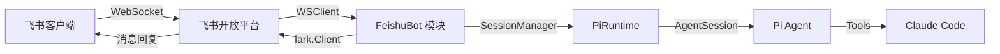
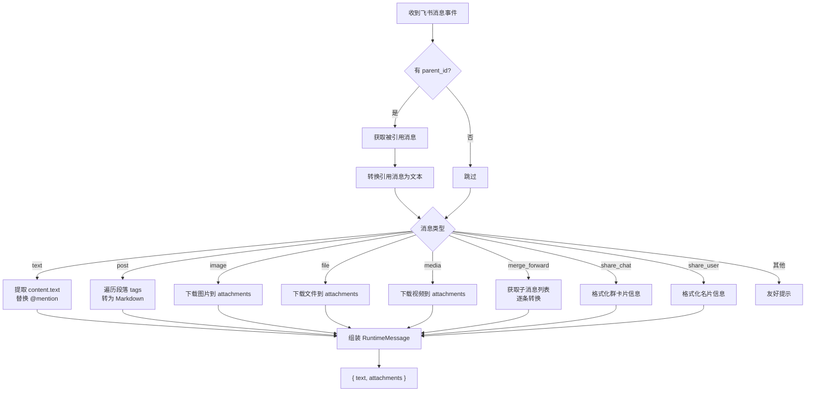
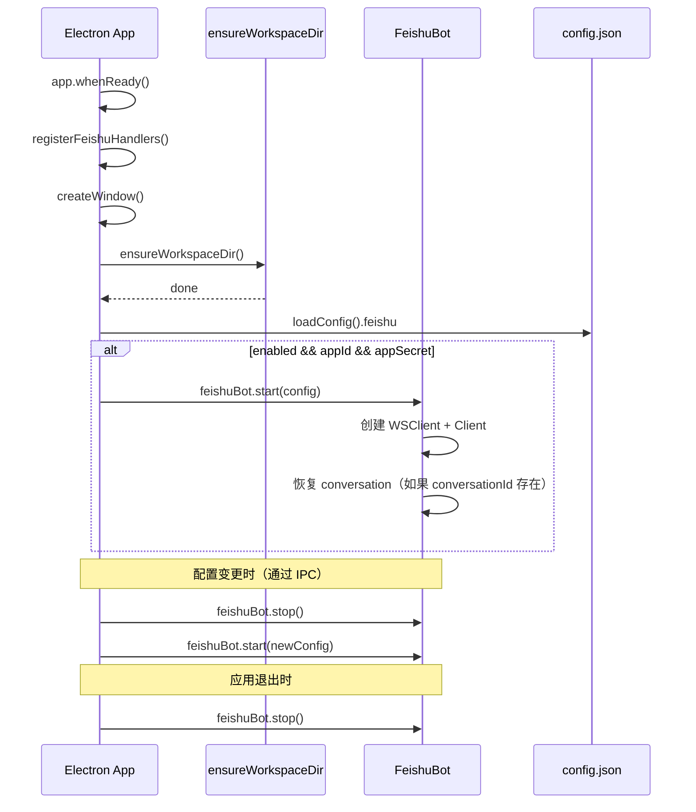

# 技术设计：飞书机器人集成

## 架构概览

飞书机器人作为 Electron 主进程中的一个独立模块，通过飞书 SDK 的 WebSocket 长连接接收消息，复用现有的 `SessionManager` + `AgentRuntime` 体系处理消息，通过飞书 API 返回结果。



## 技术栈

| 组件 | 选型 | 说明 |
|---|---|---|
| 飞书 SDK | `@larksuiteoapi/node-sdk` | 官方 Node.js SDK，内置 WebSocket 支持 |
| 事件接收 | `lark.WSClient` | WebSocket 长连接，无需公网 IP |
| API 调用 | `lark.Client` | 消息发送、文件下载、Reaction 操作 |
| Agent 运行时 | 现有 `PiRuntime` + `SessionManager` | 复用，需小幅扩展 |

## 需要修改/新增的文件

### 新增文件

| 文件 | 职责 |
|---|---|
| `src/main/lib/feishu/feishu-bot.ts` | 核心模块：WSClient 生命周期、事件分发、消息队列 |
| `src/main/lib/feishu/message-converter.ts` | 飞书消息 → Agent RuntimeMessage 转换器 |
| `src/main/lib/feishu/feishu-reply.ts` | Agent 回复 → 飞书消息发送（含分段、Reaction） |
| `src/main/lib/feishu/types.ts` | 飞书相关类型定义 |
| `src/main/handlers/feishu-handlers.ts` | IPC handlers：配置读写、启停控制 |
| `src/renderer/components/settings/FeishuSettings.tsx` | 设置页飞书配置 UI |

### 修改文件

| 文件 | 修改内容 |
|---|---|
| `src/main/lib/config.ts` | `AppConfig` 新增 `feishu?: FeishuConfig` 字段，新增读写函数 |
| `src/main/index.ts` | 注册 `registerFeishuHandlers()`，`ensureWorkspaceDir` 后启动 FeishuBot，`will-quit` 时关闭 |
| `src/preload/index.ts` | 暴露 `feishu:*` IPC 通道 |
| `src/renderer/electron.d.ts` | 新增 feishu IPC 类型 |
| `src/renderer/pages/Settings.tsx` | 新增飞书设置导航项和内容区 |
| `package.json` | 添加 `@larksuiteoapi/node-sdk` 依赖 |

## 详细设计

### 1. 配置数据结构

在 `AppConfig` 中新增：

```typescript
interface FeishuConfig {
  enabled: boolean;
  appId: string;
  appSecret: string;
  conversationId?: string;  // 固定会话的 conversationId，由系统自动生成和维护
}
```

存储路径：`~/.config/Claude Agent Desktop/config.json` 的 `feishu` 字段。

**配置安全说明：**
`appSecret` 与 Anthropic API Key 采用同级安全策略：存储在 config.json 中，通过 IPC 传输到 renderer 的设置页输入框。这与现有 `apiKey` 的处理方式完全一致，不做额外限制。

### 2. FeishuBot 核心模块

`src/main/lib/feishu/feishu-bot.ts`

```typescript
class FeishuBot {
  private wsClient: lark.WSClient | null = null;
  private client: lark.Client | null = null;
  private processedMessageIds = new Set<string>();  // 事件去重
  private pendingReply: PendingReply | null = null;  // 当前正在等待回复的消息

  static readonly CHAT_ID = 'feishu-bot';

  start(config: FeishuConfig): void
  stop(): void
  isRunning(): boolean
}

interface PendingReply {
  feishuMessageId: string;   // 飞书消息 ID，用于 reply() 引用
  feishuChatId: string;      // 飞书对话 ID，用于 create() 发送
  chunks: string[];          // 累积的回复片段
  unsubscribe: () => void;   // 事件监听取消函数
}
```

**生命周期：**
1. **启动时机**：在 `ensureWorkspaceDir()` 完成后启动（与 fileWatcher、scheduler 同级），确保工作区可用
2. `start()` 创建 `lark.Client` 和 `lark.WSClient`，注册 `im.message.receive_v1` 处理器
3. WSClient 自动维护连接（重连由 SDK 处理）
4. `stop()` 关闭 WSClient，在 `app.on('will-quit')` 中调用
5. 配置变更时先 `stop()` 再 `start()`，通过 FeishuBot 内部状态防止重复启动

**事件去重：**
- 维护最近处理的 `message_id` 集合（Set，超过 1000 条时删除最早的）
- 收到事件时先检查 `message_id` 是否已处理
- 注意：去重仅防止飞书平台的重试投递，不是持久化的幂等保证。对于应用重启场景，飞书 WebSocket 模式不会重放已确认的事件

**消息来源过滤：**
- 忽略机器人自己发出的消息（`sender.sender_type === 'app'`），防止自回复循环
- 仅处理私聊消息（`chat_type === 'p2p'`），群聊消息中仅处理 @机器人 的消息
- 单用户场景，不做发送者鉴权

### 3. 消息串行队列（解决并发串流问题）

**核心问题**：`PiRuntime` 的事件流是 runtime 级全局广播，没有 turn/request id。如果多条飞书消息并发到达，各自注册的 `onEvent` 监听器会收到彼此的事件，导致回复串话。

**解决方案**：FeishuBot 内部维护严格的消息串行队列，同一时刻只有一条消息在处理。

```typescript
class FeishuBot {
  private messageQueue: QueuedMessage[] = [];
  private pendingReply: PendingReply | null = null;

  private async enqueueMessage(data: FeishuMessageEvent): Promise<void> {
    this.messageQueue.push(data);
    if (!this.pendingReply) {
      await this.processNextMessage();
    }
    // 如果 pendingReply 已存在，说明有消息正在处理，等前一个完成后自动 drain
  }

  private async processNextMessage(): Promise<void> {
    const next = this.messageQueue.shift();
    if (!next) return;

    // 1. 转换消息
    const runtimeMessage = await convertFeishuMessage(next, this.client!, workspaceDir);

    // 2. 注册唯一监听器
    const feishuMessageId = next.message.message_id;
    const feishuChatId = next.message.chat_id;
    let fullReply = '';

    const unsubscribe = session.runtime.onEvent((event) => {
      switch (event.type) {
        case 'message-chunk':
          fullReply += event.text;
          break;
        case 'message-complete':
          this.handleComplete(feishuMessageId, feishuChatId, fullReply);
          unsubscribe();
          break;
        case 'message-error':
          this.handleError(feishuMessageId, feishuChatId, event.error);
          unsubscribe();
          break;
        case 'message-stopped':
          this.handleComplete(feishuMessageId, feishuChatId, fullReply || '（已中断）');
          unsubscribe();
          break;
      }
    });

    this.pendingReply = { feishuMessageId, feishuChatId, unsubscribe };

    // 3. 发送给 Agent
    await session.runtime.sendMessage(runtimeMessage);
  }

  private async handleComplete(messageId: string, chatId: string, text: string): Promise<void> {
    await this.replier.removeTypingReaction(messageId).catch(() => {});
    await this.replier.reply(messageId, chatId, text);
    this.saveToConversation(/* ... */);
    this.pendingReply = null;
    // drain 队列
    await this.processNextMessage();
  }
}
```

**关键保证**：同一时间只有一个 `onEvent` 监听器在收集回复，消息完成/出错后才处理下一条。这与 `PiRuntime` 内部的串行队列对齐。

### 4. 消息转换器

`src/main/lib/feishu/message-converter.ts`

```typescript
async function convertFeishuMessage(
  data: FeishuMessageEvent,
  client: lark.Client,
  workspaceDir: string
): Promise<RuntimeMessage>
```

**转换流程：**



**content 解析安全：**
飞书消息的 `content` 字段是 JSON 字符串，需要 `JSON.parse()`。所有解析都包裹在 try-catch 中，解析失败时回退为原始字符串内容，不中断消息处理流程。

**@mention 替换：**

```typescript
function replaceMentions(text: string, mentions: FeishuMention[]): string {
  for (const mention of mentions) {
    const escapedName = escapeMarkdown(mention.name);
    text = text.replace(mention.key, `[${escapedName}](${mention.id.open_id})`);
  }
  return text;
}
```

**Post 富文本转 Markdown：**

遍历段落数组，逐 tag 转换：
- `text` → 原文（`bold` → `**text**`，`italic` → `*text*`，`lineThrough` → `~~text~~`）
- `a` → `[text](href)`
- `at` → `[name](user_id)`
- `img` → 下载图片，加入附件列表
- `code_block` → `` ```lang\ncode``` ``
- `emotion` → `:emoji_type:`
- `hr` → `---`

**文本转义：**
所有拼接到 XML/Markdown 结构中的用户文本（发送者名称、群名称、链接文本等）必须转义特殊字符：
- XML 上下文：转义 `<`, `>`, `&`
- Markdown 上下文：转义 `[`, `]`, `(`, `)`

```typescript
function escapeXml(str: string): string {
  return str.replace(/&/g, '&amp;').replace(/</g, '&lt;').replace(/>/g, '&gt;');
}

function escapeMarkdown(str: string): string {
  return str.replace(/[[\]()]/g, '\\$&');
}
```

**文件下载与重名处理：**

```typescript
async function downloadToAttachments(
  client: lark.Client,
  resourceType: 'image' | 'file' | 'media',
  key: string,
  originalName: string,
  workspaceDir: string
): Promise<SavedAttachmentInfo>
```

- 文件名先通过 `sanitizeFileName()`（复用现有 `chat-helpers.ts` 中的函数）清理非法字符
- 再做 macOS 风格重名处理：`report.xlsx` → `report (1).xlsx` → `report (2).xlsx`
- 下载失败（权限不足、资源过期、网络中断）时，不中断整体消息处理，在文本中标注 `[文件下载失败: filename]`
- 文件大小超过 32MB 时，跳过下载，在文本中标注 `[文件过大: filename (size)]`

**引用消息处理：**

```typescript
async function fetchQuotedMessage(
  client: lark.Client,
  messageId: string,
  workspaceDir: string
): Promise<{ text: string; attachments: SavedAttachmentInfo[] }>
```

- 通过 `client.im.v1.message.get()` 获取被引用消息
- 解析 `body.content`（JSON 字符串）按 `msg_type` 转换
- 被撤回的消息（`deleted: true`）返回 `[消息已撤回]`
- 获取失败时返回 `[无法获取引用消息]`
- 组装格式：

```
<quoted_message sender="发送者名称" time="2026-03-28 10:30">
被引用的消息内容
</quoted_message>

用户当前发送的消息内容
```

**合并转发处理：**

通过飞书 API 获取合并转发中的子消息列表，按时间顺序遍历每条子消息，按其 `msg_type` 应用对应的转换规则，拼接为：

```markdown
> **发送者A** (10:30):
> 子消息1内容
>
> **发送者B** (10:31):
> 子消息2内容
```

子消息中的附件同样下载到 attachments。单条子消息处理失败不影响其他子消息。

### 5. 回复发送器

`src/main/lib/feishu/feishu-reply.ts`

```typescript
class FeishuReplier {
  constructor(private client: lark.Client) {}

  async addTypingReaction(messageId: string): Promise<void>
  async removeTypingReaction(messageId: string): Promise<void>
  async reply(messageId: string, chatId: string, text: string): Promise<void>
  async sendError(chatId: string, error: string): Promise<void>
}
```

**回复逻辑：**
1. 收到用户消息 → `addTypingReaction(messageId)`（失败不阻塞后续流程）
2. Agent 处理完成 → `removeTypingReaction(messageId)`（best-effort） + `reply(messageId, chatId, fullText)`
3. 出错 → `removeTypingReaction(messageId)` + `sendError(chatId, errorMessage)`

**Reaction 容错：**
Reaction 操作是 best-effort 的——所有 Reaction 调用都 catch 错误静默忽略。不同租户权限、聊天类型、消息类型对 Reaction 的支持不一致，不能让 Reaction 失败阻塞主流程。

**消息分段：**
飞书文本消息限制约 4000 字符。超长回复按段落边界拆分：
- 第一段用 `client.im.v1.message.reply()`（引用原消息）
- 后续段用 `client.im.v1.message.create()`（同一对话，不再引用）

**API Key 校验：**
在消息处理前检查 API Key 是否已配置（复用 `getMissingApiKeyMessage()` 逻辑）。如果未配置，直接回复飞书用户："API Key 未配置，请在桌面端设置中添加。"

### 6. 会话持久化（解决 chatId/conversationId 映射问题）

**核心问题**：现有 conversation-db 的 ID 是 `Date.now().toString()` 生成的，不是 chatId。FeishuBot 需要一个稳定的 conversationId 来跨重启恢复会话。

**解决方案**：在 `FeishuConfig` 中持久化 `conversationId`。

```typescript
// 首次启动飞书机器人时
const conversationId = createConversation('飞书对话', []);
feishuConfig.conversationId = conversationId;
saveConfig(config);

// 后续启动时
const conversation = getConversation(feishuConfig.conversationId);
if (conversation) {
  // 恢复会话：用 conversation.sessionId 恢复 Agent 状态
  const session = sessionManager.getOrCreate(FeishuBot.CHAT_ID);
  if (conversation.sessionId) {
    await session.runtime.reset(conversation.sessionId);
  }
}
```

**消息持久化流程**（在 FeishuBot 主进程中完成，不依赖 renderer）：
1. 收到用户消息后，追加 user message 到 conversation
2. Agent 回复完成后，追加 assistant message 到 conversation
3. 更新 conversation 的 `sessionId`

**桌面端可见性**：conversation-db 中的飞书会话记录在桌面端的会话列表中自然可见（因为 `listConversations()` 会返回它）。但桌面端打开这个会话时是只读的——因为 FeishuBot 持有该会话的 runtime。桌面端不应该尝试恢复同一个 session 来发消息，只能查看历史。

**双 runtime 冲突防护**：
- 飞书会话在桌面端标记为 `feishu-bot` 来源
- 桌面端加载该会话时，只展示消息历史，禁用输入框
- 这避免了两个 runtime 对同一 Agent session 的并发操作

### 7. IPC 通道设计

| 通道 | 方向 | 说明 |
|---|---|---|
| `feishu:get-config` | renderer → main | 获取飞书配置（含 appId、appSecret） |
| `feishu:set-config` | renderer → main | 保存飞书配置，配置变更时自动重启连接 |
| `feishu:get-status` | renderer → main | 获取连接状态（disconnected / connecting / connected） |
| `feishu:start` | renderer → main | 启动 WebSocket 连接 |
| `feishu:stop` | renderer → main | 停止连接 |

### 8. 设置页 UI

在 Settings.tsx 的导航列表中添加"飞书机器人"项，内容区包含：

- App ID 输入框
- App Secret 输入框（密码样式，与 API Key 输入框同级安全性）
- 启用/禁用开关（配置不完整时 disabled）
- 连接状态指示（未连接 / 连接中 / 已连接）

样式遵循现有设置页的 Notion 风格，与其他设置项保持一致。

### 9. 启停时序



### 10. macOS 窗口关闭行为

macOS 关闭所有窗口后 app 不退出（现有行为）。这意味着 FeishuBot 的 WebSocket 连接在窗口关闭后仍然保持——这是期望的行为：用户关闭窗口后仍可通过飞书控制 Agent。

Windows/Linux 关窗口即退出——FeishuBot 随 app 生命周期结束。

## 测试策略

| 层次 | 测试内容 | 方式 |
|---|---|---|
| 单元测试 | `message-converter.ts` 各消息类型转换（text、post、image、file、引用、合并转发） | Bun test，mock lark.Client |
| 单元测试 | `feishu-reply.ts` 消息分段逻辑 | Bun test |
| 单元测试 | 文件重名处理 + sanitizeFileName 集成 | Bun test |
| 单元测试 | 文本转义（XML + Markdown） | Bun test |
| 单元测试 | 消息串行队列（确保不串流） | Bun test，mock runtime events |
| 集成测试 | 完整消息流（飞书事件 → Agent → 回复） | 手动测试，需飞书开发者账号 |
| 打包测试 | 验证飞书 SDK 在 electron-vite 打包后正常工作 | 手动 `bun run build:mac` 后测试 |

## 安全考虑

1. **App Secret 存储**：与 Anthropic API Key 同级——存在 config.json，通过 IPC 传到 renderer 设置页
2. **WebSocket 安全**：SDK 内置 TLS 加密，连接经过飞书平台认证
3. **消息来源过滤**：忽略机器人自己的消息防止自回复，仅处理私聊和 @机器人 的群聊消息
4. **文件安全**：文件名 sanitize + 大小限制（32MB），防止路径注入和磁盘占满
5. **文本转义**：所有拼接到结构化文本中的用户内容都做转义，防止 prompt 注入
